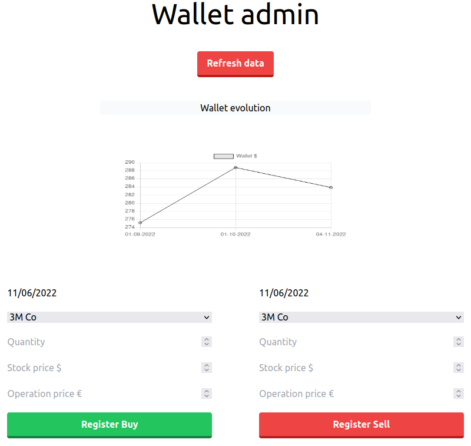
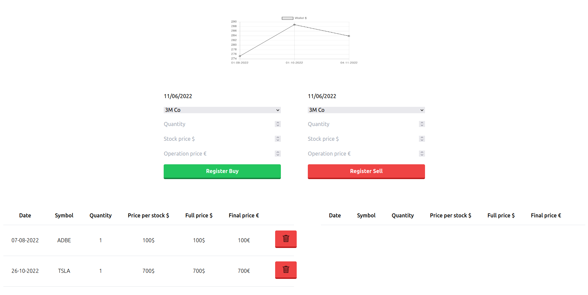

# Stock application

An application done in Python and JavaScript to provide information about the market in a well presented frontend done with React.

# How to run

For run you need: 
- docker and docker-compose in your machine.

- a Finnhub token in puller env, to be able to pull data.

After that you can run this application by using from the root directory the following command:

`bash run.sh`

# How to use

With your browser go to `wallet.localhost`, there you can register your stocks and see the evolution of your wallet, apart you can start to pull information with the `Refresh data` button (Be careful, just press one time and go see the logs, your computer could implode if you start pulling so many times at once).

# Next features

## Soon

- Knowledge of when the puller is working in UI

- Implementation of charts and tables to represent all the information from the puller

- Recommendations of buys and sells based on MACD

- Calculation of MACD by the service itself and not by pulling (this will allow to have the current month)

- Find better API for quarterly reports, Finnhub is quite outdated

## Later

- Pull raw materials price

- Pull macro indicators

- Creation of TF model with all collected data
