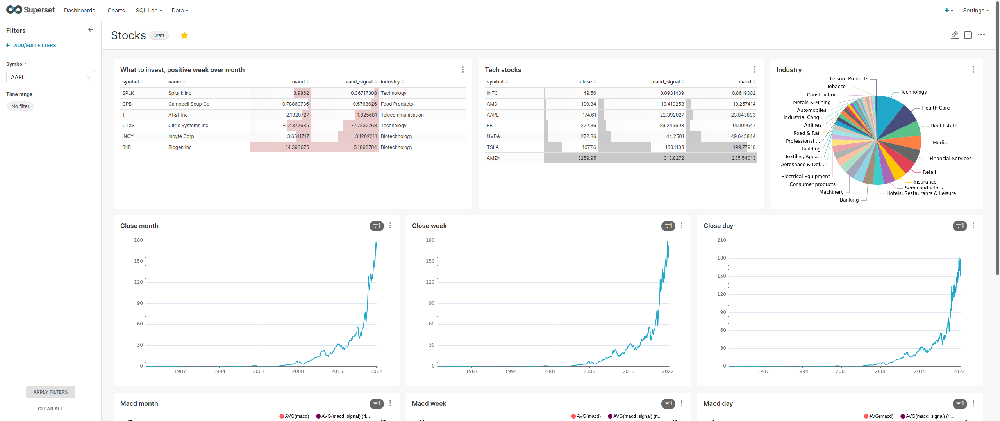
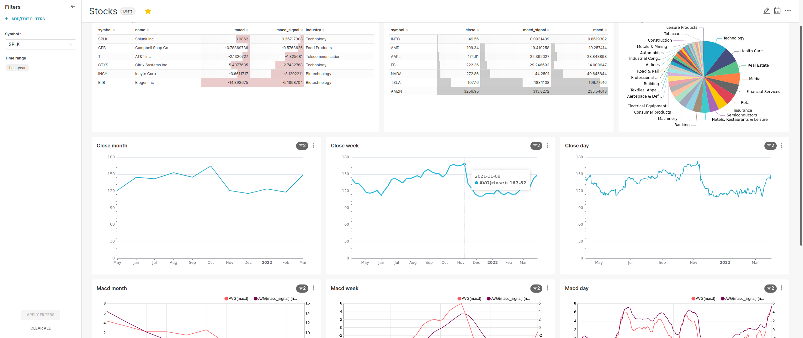

# Stock looker
An application to pull information of the stocks of the companies 
that are part of the SP500, Nasdaq100, DOW, ETH and BTC.


### Pre-requisites 📋
To use this application you need to have Docker 
installed and know the basics.

Also, you need to create inside `puller/drivers/finhub` a file called `finnhub_token.py`,
this file should contain the constant for your token from Finnhub as follows:

```python
API_TOKEN = '&token=YOUR-TOKEN-STRING'

```

## Deploy 📦
You can run the `script.py` to just populate the database or use the `service.py` as a service for refresh the data every certain amount of time.

## Limitations 
This program is thought for the free version of Finnhub API, if you desire to use it with a premium account you should change the line 17 from `self._semaphore = asyncio.Semaphore(60)` to `self._semaphore = asyncio.Semaphore(1000)` in `puller/puller.py` 

## Info 📖
For now, the program `pull information of prices and MACd` in the intervals of day, week and month, 
also pull some information of the business as the industry, the full name, ipo, etc

As you will see in the docker-compose file, 
this project is compatible with the docker superset project.

Here is an example representing the data this project can pull:




